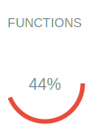

# Documentação técnica - Profzera API

Aplicação backend desenvolvida em Node.js com Express, utilizando PostgreSQL como banco de dados relacional, containerização com Docker para a garantia de consistência entre ambientes.
Implementação de Swagger/OpenAPI para documentação e testes em Jest.

## Profzera API

[](https://docs.docker.com)
[](https://nodejs.org/)
[](https://www.postgresql.org/)

**API para gestão de posts de conteúdos educacionais**  

### Cobertura dos testes
   


---

## Índice
1. [Requisitos](#requisitos)
2. [Variáveis de ambiente](#variáveis-de-ambiente)
3. [Docker](#docker)
4. [Banco de dados do PostgreSQL](#banco-de-dados-do-postgreSQL)
5. [Comandos](#comandos)
6. [Guia de uso das APIs](#guia-de-uso-das-APIs)
7. [Testes](#testes)
8. [Documentação](#documentação)
9. [CI e CD com Deploy em Cloud do Render](#ci-e-cd-com-deploy-em-cloud-do-render)
10. [Contribuição](#contribuição)

---

### Requisitos

- [Docker](https://docs.docker.com/get-docker/)
- [Node.js 20+](https://nodejs.org/en/download/)
- [PostgreSQL 17+](https://www.postgresql.org/download/)

#### Links auxiliares

| Recurso    | Descrição                  | Link                             |
|------------|----------------------------|----------------------------------|
| Node.js    | Runtime JavaScript         | https://nodejs.org/en/docs       |
| Express    | Framework web para Node.js | https://expressjs.com/           |
| PostgreSQL | Banco de dados relacional  | https://www.postgresql.org/docs/ |


```bash
# Clone o repositório do GitHub usando HTTPs, SSH ou GitHub Cli
git clone https://github.com/katehori/profzera.git
```

---

### Variáveis de ambiente

```bash
# Copie o arquivo .env.example para criar as variáveis de ambiente no .env
cp .env.example .env
```

Crie um arquivo .env baseado no .env.example:

```ini
NODE_ENV=
NODE_PORT=

# Banco de Dados
DB_HOST=
DB_PORT=
DB_USER=
DB_PASSWORD=
DB_NAME=

# Autenticação
JWT_SECRET=
```

---

### Docker

- [DockerHub](https://hub.docker.com/repository/docker/katehori/profzera-app/)

Docker Compose para orquestração de serviços:

- Container Node.js (profzera-backend): Aplicação.
- Container PostgreSQL (postgresdb): Banco de dados.

```bash
# Para subir o Node.js e PostgreSQL (ambiente completo)
docker-compose up
# ou
docker-compose up -d

# Para subir individualmente
docker-compose up -d postgresdb_ou_profzera-backend
```

#### Links auxiliares

| Recurso        | Descrição                     | Link                             |
|----------------|-------------------------------|----------------------------------|
| Docker         | Conteinerização               | https://docs.docker.com/         |
| Docker Compose | Orquestração de containers    | https://docs.docker.com/compose/ |


#### Banco de dados do PostgreSQL

```bash
docker-compose up -d postgresdb
```

---

### Comandos

```bash
# Para instalar as dependências do Node.js
npm install

# Para rodar em desenvolvimento (localhost) usando o Nodemon
npm run dev

# Para build
npm run build
```

---

### Guia de uso das APIs

#### Endpoints

| Método      | Rota                    | Descrição                                         | Autenticação  |
|-------------|-------------------------|---------------------------------------------------|---------------|
| GET         | /api/posts/search?term= | Busca por termo no título ou conteúdo de um post  | ❌            | 
| GET         | /api/posts              | Lista todos os posts                              | ❌            |
| POST        | /api/posts              | Cria um novo post                                 | Professor     |
| GET         | /api/posts/:id          | Lista um post por ID                              | ❌            |
| PUT         | /api/posts/:id          | Atualiza um post                                  | Professor     |
| DELETE      | /api/posts/:id          | Excluí um post                                    | Professor     |

#### Exemplo de Request - Criação de um post

```http
POST /api/posts  
Authorization: Bearer <token>  
Content-Type: application/json  

{ "title": "Título do post", "content": "Conteúdo do post", "author": "Prof. Nome e Sobrenome"  }  
```

#### Exemplo de Response - Criação de um post (status 201)

```json
{  
  "id": 1,  
  "title": "Título do post",
  "content": "Conteúdo do post",  
  "author": "Prof. Nome e Sobrenome" 
}  
```

#### Links auxiliares

| Recurso | Descrição                               | Link                                    |
|---------|-----------------------------------------|-----------------------------------------|
| Postman | Teste de APIs                           | https://www.postman.com/                |

---

### Testes

Jest como framework de testes, com cobertura de Testes unitários (lógica de negócio).

```bash
# Executar todos os testes
npm test

# Testes com cobertura
npm run test:coverage

# Testar um arquivo específico
npm test -- PostController.test.js
```

#### Links auxiliares

| Recurso   | Descrição                              | Link                                    |
|-----------|----------------------------------------|-----------------------------------------|
| Jest      | Framework de testes                    | https://jestjs.io/docs/getting-started  |


---

### Documentação

Configuração via `swagger-jsdoc` e `swagger-ui-express`, integrada ao middleware do Express.

[Documentação no Swagger UI](http://localhost:8080/api-docs)

#### Links auxiliares

| Recurso    | Descrição                              | Link                                 |
|------------|----------------------------------------|--------------------------------------|
| Swagger UI | Documentação interativa de APIs        | https://swagger.io/tools/swagger-ui/ |
| OpenAPI    | Especificação de APIs                  | https://www.openapis.org/            |

---

### CI e CD com Deploy em Cloud do Render

Pipeline com testes automatizados (Jest)

Docker build no [DockerHub](https://hub.docker.com/repository/docker/katehori/profzera-app/)

Deploy no [Render](https://profzera.onrender.com)

#### Links auxiliares

| Recurso | Descrição                               | Link                                    |
|---------|-----------------------------------------|-----------------------------------------|
| Render  | Hospedagem em cloud                     | https://render.com/docs                 |
| Git     | Controle de versão                      | https://git-scm.com/doc                 |
| Dotenv  | Gerenciamento de variáveis de ambiente  | https://www.npmjs.com/package/dotenv    |

---

### Contribuição

1. Faça um fork do projeto
2. Crie sua branch `git checkout -b feature/nova-funcionalidade`
3. Commit suas mudanças `git commit -m 'Mensagem descrevendo a nova funcionalidade'`
4. Push para a branch `git push origin feature/nova-funcionalidade`
5. Abra um Pull Request

---
